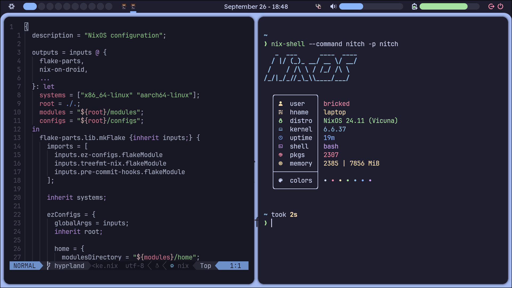
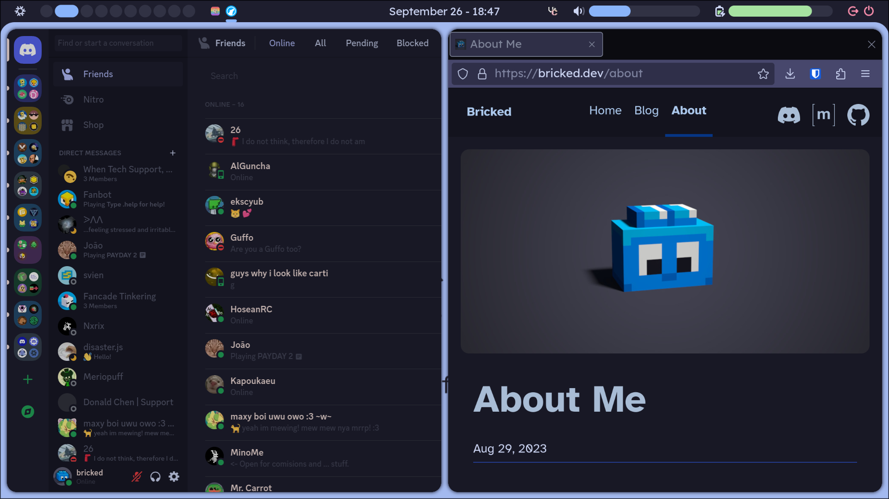

# NixDots

[](LICENSE.md)

Dotfiles for NixOS using Flakes. Contains modules and configurations for NixOS, nix-on-droid and Home Manager.




## Using existing configurations

1. Make sure to have [NixOS](https://nixos.org/manual/nixos/stable/index.html#ch-installation),
   [nix-on-droid](https://github.com/nix-community/nix-on-droid#try-it-out) or just
   [Nix](https://nixos.org/download#download-nix) properly installed.

2. [Enable Flakes](https://nixos.wiki/wiki/Flakes#Enable_flakes_temporarily) if you haven't already.

3. Enter the repository.

```bash
git clone --depth 1 https://github.com/brckd/nixdots
cd nixdots
```

4. Build and activate the home configuration.

```bash
nix run home-manager/master -- switch --flake .
```

5. Build and activate the system configuration, if one exists.

On NixOS (device specific)

```bash
sudo nixos-rebuild switch --flake .
```

On nix-on-droid

```bash
nix-on-droid switch --flake .
```

## Creating new Configurations

### On NixOS

1. Create a new directory at `./configurations/nixos/$HOSTNAME`.

2. Use `nixos-generate-config` to create a hardware configuration.

```bash
nixos-generate-config --dir ./configurations/nixos/$HOSTNAME
```

3. Create a `default.nix` module that imports `configuration.nix` to configure your system.

### On nix-on-droid

Just override the existing configuration in `./configurations/droid/default.nix`.

### On Home Manager

1. Create a new directory at `./configurations/home/$USERNAME`

2. Create a `default.nix` module to configure your user.

## Acknowledgements

Special thanks to the dotfiles that heavily inspired me!

- [Ellie](https://github.com/ehllie/dotfiles)
- [Notusknot](https://github.com/notusknot/dotfiles-nix)
- [Misterio77](https://github.com/Misterio77/nix-starter-configs)
- [Aylur](https://github.com/Aylur/dotfiles)
- [LilleAila](https://github.com/LilleAila/dotfiles/tree/main/home/programs/wm/ags)
- [Vimjoyer](https://github.com/vimjoyer/nixvim-video)
- [NvChad](https://github.com/NvChad/NvChad)

See the [Flake inputs](./flake.nix) for some of the programs used.
Check my [GitHub stars](https://github.com/brckd?tab=stars) for more incredible projects!
