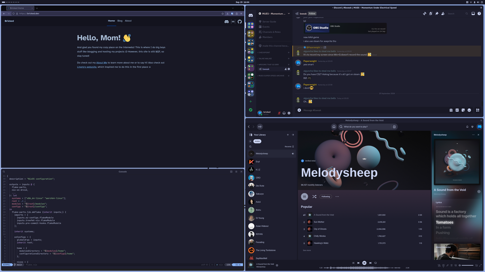
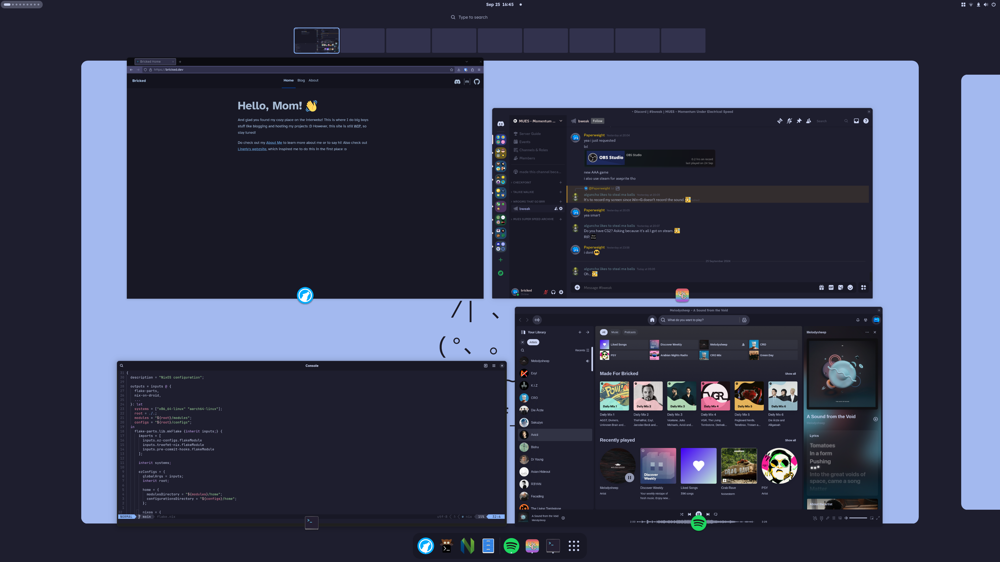

<div align="center">

# NixDots
Simple - Sane - Secure
</div>

Nix configurations as simple as possible. Runs anywhere nix does!




## Setup

Fetch the configuration first.
```sh
git clone --depth 1 https://github.com/brckd/nixdots
cd nixdots
```

[Enable Flakes](https://wiki.nixos.org/wiki/Flakes#Enable_flakes_temporarily) if you haven't already. Afterwards, setup the systems you're using.

### NixOS

Create a new configuration for the current system.
```sh
config_dir=configs/nixos/$(hostname)
mkdir $config_dir
nixos-generate-config --dir $config_dir
mv $config_dir/configuration.nix $config_dir/default.nix
```

### Home Manager

Create a new configuration for the current user.
```sh
config_dir=configs/home/$(whoami)
mkdir $config_dir
touch $config_dir/default.nix
```

### Nix-on-Droid

Just override the configuration in `configs/droid/default.nix`.

## Installation

### Home Manager

```sh
nix run nixpkgs#nh home switch .
```

### NixOS

```sh
nix run nixpkgs#nh os switch .
```

### Nix-on-Droid

```sh
nix-on-droid switch --flake .
```

## Development

### Formatting

```sh
nix fmt
```

## Further Reference

### Partitioning

See https://jadarma.github.io/blog/posts/2024/08/installing-nixos-with-flakes-and-lvm-on-luks

### Secure Boot

There is experimental secure boot support for NixOS. Use at your own risk!
```sh
sudo nix run nixpkgs#sbctl create-keys
```

Enable Secure Boot in your BIOS and enter Setup Mode or erase the Platform Keys.

```sh
sudo nix run nixpkgs#sbctl enroll-keys -- --microsoft
```
Also see https://github.com/nix-community/lanzaboote/blob/master/docs/QUICK_START.md

### TPM Disk Unlock

TPM can be used to automatically unlock encrypted partitions. After enabling this feature in the BIOS, setup your partitions. For each encrypted partition, run the following command by replacing `<encrypted-partion>` with its identifier, e.g. `nvme0n1p1` or `sda1`.

```sh
sudo systemd-cryptenroll --tpm2-device=auto --tpm2-pcrs=0+2+7+12 /dev/<encrypted-partition>
```

Also see https://jnsgr.uk/2024/04/nixos-secure-boot-tpm-fde/#tpm-unlock-of-root-partition
